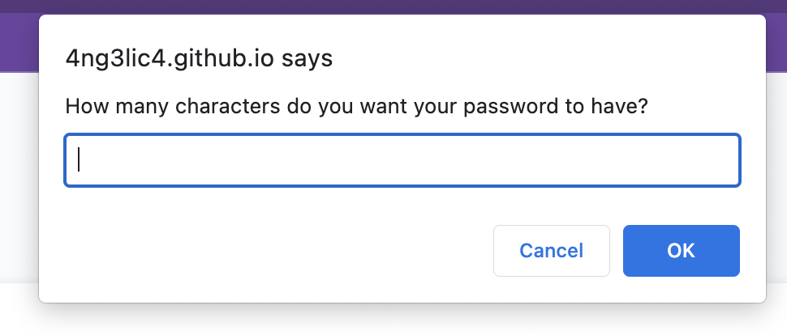
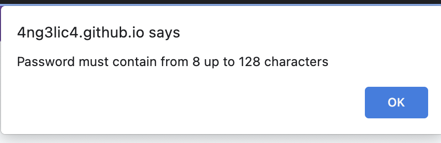
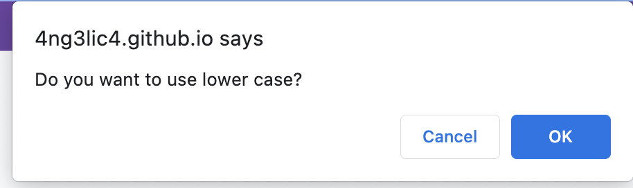
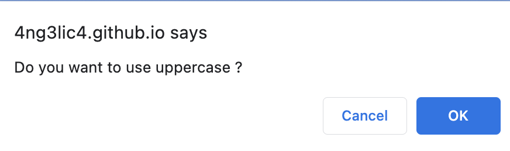
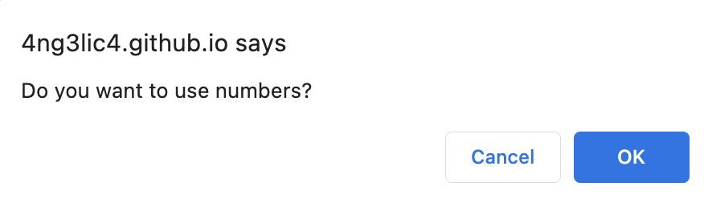
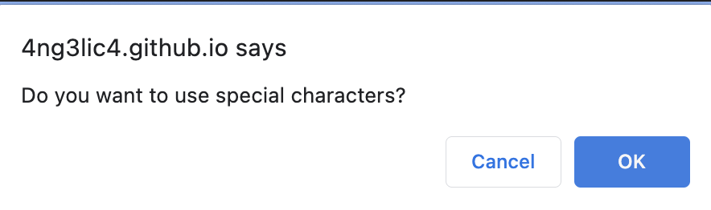
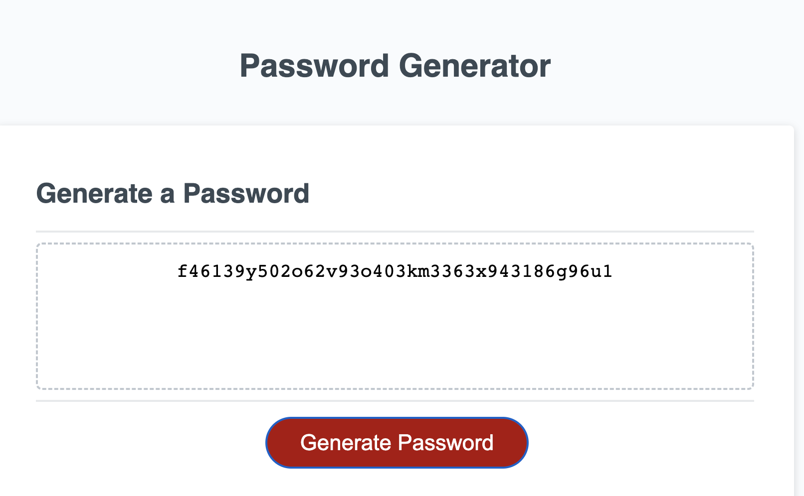
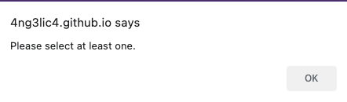
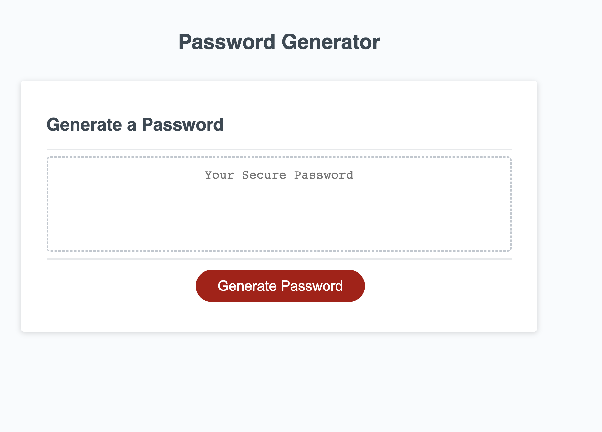

# JavaScript_Password

## Description

I want to create a password to protect sensitive information that I have acccess to as an employee.
The password should be strong with a mix of different characters and a min lenght of 8 characters and a max of 128.
I built this project to increase the security where the data is stored and prevent any hackers from stealing information.
It solved the problem of choosing a password that meets the criteria for a password that is hard to guess.

## Table of Contents 

- [Usage](#usage)
- [Mock-Up](#mock-up)
- [Finished Product](#finished-product)
- [Credits](#credits)
- [License](#license)

## Usage

STEP 1

On the home screen, click on the red button to generate a password.
A pop up willdow will appear and the user will have to enter how many characters they want their password to have

STEP 2

 If user picks a number less than 8 and higher than 128, a pop-up window will prompt the user to choose a length of at least 8 characters and no more than 128 characters

STEP 3

 Once the user enters the correct amount, a pop up window will prompt the user to chose what kind of  character they wish to include in the password (lowercase, uppercase, numeric, and/or special characters)

 
 
 
 

When the user enters their input, it will be validated. When at least one character type is selected and all prompts are answered, then a password that matches the selected criteria will be generated and displayed in an alert.
 

In the case that the user provides input that does not correspond to what the prompt is asking, then a text in a dialog box that pops up on the screen will appear requesting the user for the proper input (e.g. User clicks CANCEL to all the options to generate the password
 

## Mock-Up

The project is intended to look like the following example:

## Finished-product

Here is the link of the finished work: 

[Deployed website](https://4ng3lic4.github.io/JavaScript_Password/)

## Credits

Angelica Ibarra Ochoa

[W3 JavaScript Array push() tutorial](https://www.w3schools.com/jsref/jsref_push.asp) |
[W3 JavaScript Math.random() tutorial](https://www.w3schools.com/js/js_random.asp) |
[W3 JavaScript  isNaN() tutorial](https://www.w3schools.com/jsref/jsref_isnan.asp) |
[W3 JavaScript Window confirm()](https://www.w3schools.com/jsref/met_win_confirm.asp) |

## License

MIT License

Copyright (c) 2022 Angelica

Permission is hereby granted, free of charge, to any person obtaining a copy
of this software and associated documentation files (the "Software"), to deal
in the Software without restriction, including without limitation the rights
to use, copy, modify, merge, publish, distribute, sublicense, and/or sell
copies of the Software, and to permit persons to whom the Software is
furnished to do so, subject to the following conditions:

The above copyright notice and this permission notice shall be included in all
copies or substantial portions of the Software.

THE SOFTWARE IS PROVIDED "AS IS", WITHOUT WARRANTY OF ANY KIND, EXPRESS OR
IMPLIED, INCLUDING BUT NOT LIMITED TO THE WARRANTIES OF MERCHANTABILITY,
FITNESS FOR A PARTICULAR PURPOSE AND NONINFRINGEMENT. IN NO EVENT SHALL THE
AUTHORS OR COPYRIGHT HOLDERS BE LIABLE FOR ANY CLAIM, DAMAGES OR OTHER
LIABILITY, WHETHER IN AN ACTION OF CONTRACT, TORT OR OTHERWISE, ARISING FROM,
OUT OF OR IN CONNECTION WITH THE SOFTWARE OR THE USE OR OTHER DEALINGS IN THE
SOFTWARE.

